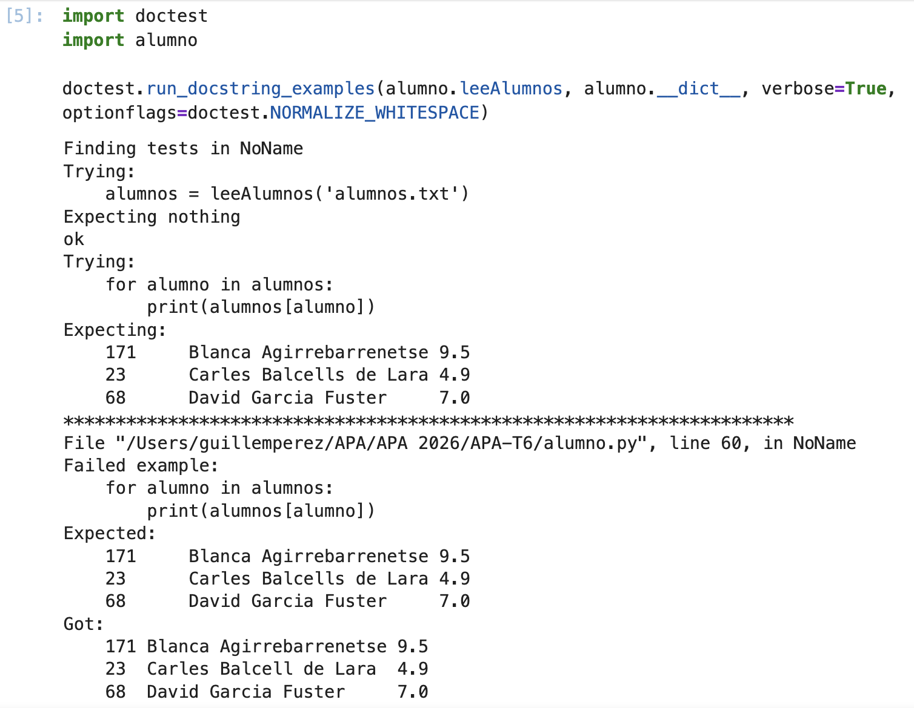

# Expresiones Regulares

## Nom i cognoms

> [!Important]
> Introduzca a continuación su nombre y apellidos:
>
> Fulano Mengano Zutano

## Aviso Importante

> [!Caution]
> 
> El objetivo de esta tarea es aprender a usar las expresiones regulares. En concreto, su
> implementación en Python. A los profesores de la asignatura les importa un pimiento si
> usted conoce alguna biblioteca que hace el mismo trabajo de manera más sencilla y/o
> eficiente; su uso está prohibido.
>
> ¿Quiere saber más?, consulte con el profesorado.
 
## Fecha de entrega: 7 de junio a medianoche

## Tratamiento de ficheros de notas

Con el final de curso llega la ardua tarea de evaluar las tareas realizadas por los alumnos durante el
mismo. Para facilitar esta tarea, se dispone de la clase `Alumno` que proporciona los datos
fundamentales de cada alumno: su número de identificación (`numIden`), su nombre completo 
(`nombre`) y la lista de notas obtenidas a lo largo del curso (`notas`). La clase también
proporciona métodos para añadir una nota al expediente del alumno (`__add__()`), para obtener
la representación *oficial* del mismo (`__repr__()`) y para obtener la representación
*bonita* (`__str__()`).

La definición de la clase `Alumno`, disponible en `alumno.py`, es:

```python
class Alumno:
    """
    Clase usada para el tratamiento de las notas de los alumnos. Cada uno
    incluye los atributos siguientes:

    numIden:   Número de identificación. Es un número entero que, en caso
               de no indicarse, toma el valor por defecto 'numIden=-1'.
    nombre:    Nombre completo del alumno.
    notas:     Lista de números reales con las distintas notas de cada alumno.
    """

    def __init__(self, nombre, numIden=-1, notas=[]):
        self.numIden = numIden
        self.nombre = nombre
        self.notas = [nota for nota in notas]

    def __add__(self, other):
        """
        Devuelve un nuevo objeto 'Alumno' con una lista de notas ampliada con
        el valor pasado como argumento. De este modo, añadir una nota a un
        Alumno se realiza con la orden 'alumno += nota'.
        """
        return Alumno(self.nombre, self.numIden, self.notas + [other])

    def media(self):
        """
        Devuelve la nota media del alumno.
        """
        return sum(self.notas) / len(self.notas) if self.notas else 0

    def __repr__(self):
        """
        Devuelve la representación 'oficial' del alumno. A partir de copia
        y pega de la cadena obtenida es posible crear un nuevo Alumno idéntico.
        """
        return f'Alumno("{self.nombre}", {self.numIden!r}, {self.notas!r})'

    def __str__(self):
        """
        Devuelve la representación 'bonita' del alumno. Visualiza en tres
        columnas separas por tabulador el número de identificación, el nombre
        completo y la nota media del alumno con un decimal.
        """
        return f'{self.numIden}\t{self.nombre}\t{self.media():.1f}'
```

A menudo, las notas de los alumnos se almacenan en ficheros de texto en los que los datos de cada alumno
ocupan una línea con los distintos valores separados por espacios y/o tabuladores.

El ejemplo siguiente muestra un fichero típico con las notas de tres alumnos:

```text
171 Blanca Agirrebarrenetse 10  	9 	  9.5
23  Carles Balcell de Lara  5 	    5 	  4.5  	5.2
68  David Garcia Fuster 	7.75    5.25  8   
```

Añada al fichero `alumno.py` la función `leeAlumnos(ficAlum)` que lea un fichero de texto con los datos de 
todos los alumnos y devuelva un diccionario en el que la clave sea el nombre de cada alumno y su contenido 
el objeto `Alumno` correspondiente.

La función deberá cumplir los requisitos siguientes:

- Sólo debe realizar lo que se indica; es decir, debe leer el fichero de texto que se le pasa como único
  argumento y devolver un diccionario con los datos de los alumnos.
- El análisis de cada línea de texto se realizará usando expresiones regulares.
- La función `leeAlumnos()` debe incluir, en su cadena de documentación, la prueba unitaria siguiente según
  el formato de la biblioteca `doctest`, donde el fichero `'alumnos.txt'` es el fichero mostrado como ejemplo
  al principio de este enunciado:

  ```python
  >>> alumnos = leeAlumnos('alumnos.txt')
  >>> for alumno in alumnos:
  ...     print(alumnos[alumno])
  ...
  171     Blanca Agirrebarrenetse 9.5
  23      Carles Balcells de Lara 4.9
  68      David Garcia Fuster     7.0
  ```

  - Evidentemente, es responsabilidad del autor comprobar que la prueba unitaria se pasa satisfactoriamente
    antes de la entrega de la tarea.

  - Para evitar que diferencias debidas a espacios en blanco o tabuladores den lugar a error, se recomienda
    efectuar las pruebas unitarias con la opción `doctest.NORMALIZE_WHITESPACE`. Por ejemplo,
    `doctest.testmod(optionflags=doctest.NORMALIZE_WHITESPACE)`.


## Análisis de expresiones horarias

En casi todos los idiomas más habituales, cualquier hora puede reducirse al formato estándar HH:MM, donde HH es 
un número de dos dígitos, que representa la hora y está comprendido entre 00 y 23, y MM es otro número de dos 
dígitos, que representa el minuto y está comprendido entre 00 y 59.

No obstante, en el lenguaje hablado, es raro usar este formato estándar. En el caso del castellano, existe una
gran variedad de formatos. La lista siguiente alguna de las posibilidades más frecuentes, aunque existen bastantes
más:

- **08:27**

  Es el formato estándar. Cuando la hora es menor que 10, es posible representarla con
  dos dígitos (08:27), o sólo uno (8:27). Los minutos se representan siempre con dos (8:05).

- **8h27m**

  Las horas o minutos menores que 10 pueden representarse usando uno o dos dígitos. Las horas
  *en punto* pueden indicarse sin minutos (8h).

- **8 en punto**

  Las horas exactas suelen indicarse con la partícula *'en punto'*. En ese caso, es
  habitual omitir la letra *h* después de la cifra.

  Otras alternativas semejantes son las *'8 y cuarto'*, las *'8 y media'* o las *'8 menos cuarto'*.

  En todos estos casos, el reloj empleado será de 12 horas y empezando en 1 (de 1 a 12). El
  resultado será ambiguo, ya que no sabremos si una cierta hora es AM o PM, pero así es cómo
  se suele hablar (la gente queda a *'las 11 en punto'* para ir a una fiesta, no a las
  *'las 23 en punto'*). El resultado se devolverá siempre en el rango de 00:00 a 11:59.

- **... de la mañana**

  Las expresiones horarias entre las 4 y las 12 pueden ir seguidas de la partícula *'de la mañana'*.

  Análogamente, las horas entre las 12 y las 3 pueden ir seguidas de *'del mediodía'*, las horas entre
  las 3 y las 8 pueden serlo de *'de la tarde'*, entre 8 y 4 de *'de la noche'* y entre 1 y
  6 de *'de la madrugada'*.

  En estos casos, el reloj empleado es siempre de 12 horas (nunca se dice *'las 18 de la tarde'*, sino
  *'las 6 de la tarde'*). Además la hora no puede ser cero, sino que, en ese caso, se usaría 12.

### Tarea: normalización de las expresiones horarias de un texto

Escriba el fichero `horas.py` con la función `normalizaHoras(ficText, ficNorm)`, que lee el fichero de
texto `ficText`, lo analiza en busca de expresiones horarias y escribe el fichero `ficNorm` en el que
éstas se expresan según el formato normalizado, con las horas y los minutos indicados por dos dígitos
y separados por dos puntos (08:27).

Cada línea del fichero puede contener, o no, una o más expresiones horarias, pero éstas nunca aparecerán
partidas en más de una línea.

Las horas con expresión incorrecta, por ejemplo, *'17:5'* (en la expresión normalizada deben usarse dos
dígitos para expresar los minutos) u *'11 de la tarde'* (la tarde nunca llega hasta esa hora), deben
dejarse tal cual.

Para la evaluación de la tarea se usará un texto con unas cien expresiones horarias, que incluirán tanto
expresiones correctas como incorrectas. Una parte de la nota dependerá de la precisión en su normalización.

Se recomienda empezar normalizando textos que sólo contengan expresiones correctas del tipo más sencillo;
es decir, con la forma *'18h45m'*. La consecución de este objetivo garantiza una nota mínima de notable
bajo (7). La extensión al resto de formatos indicados y la detección de expresiones incorrectas serán
necesarias para alcanzar la nota máxima (10).

La tabla siguiente muestra un ejemplo de texto antes y después de su normalización, incluyendo tanto
expresiones horarias **correctas** como <span style="color:red">**incorrectas**</span>.

### Ejemplo de normalización de las expresiones horarias de un texto

Las líneas siguientes muestran ejemplos de expresiones horarias, tanto correctas como incorrectas. Las
mismas expresiones se encuentran en el fichero `horas.txt`, que puede usar para comprobar el correcto
funcionamiento de su función.

#### Expresiones válidas

> - La llegada del tren está prevista a las **18:30**
> - La llegada del tren está prevista a las **18:30**

> - Tenía su clase entre las **8h** y las **10h30m**
> - Tenía su clase entre las **08:00** y las **10:30**

> - Se acaba a las **4 y media de la tarde**
> - Se acaba a las **16:30**

> - Empieza a trabajar a las **7h de la mañana**
> - Empieza a trabajar a las **07:00**

> - Es lo mismo **5 menos cuarto** que **4:45**
> - Es lo mismo **04:45** que **04:45**

> - Tenemos descanso hasta las **17h5m**
> - Tenemos descanso hasta las **17:05**

> - Las campanadas son a las **12 de la noche**
> - Las campanadas son a las **00:00**

#### Expresiones incorrectas

> - Son exactamente las $\textbf{\color{red}17:5}$
> - Son exactamente las $\textbf{\color{red}17:5}$

> - Cuando llegó, ya eran las $\textbf{\color{red}11 de la tarde}$
> - Cuando llegó, ya eran las $\textbf{\color{red}11 de la tarde}$

> - El examen es a las $\textbf{\color{red}17 de la tarde}$
> - El examen es a las $\textbf{\color{red}17 de la tarde}$

> - Cenamos en las $\textbf{\color{red}7}$ puertas
> - Cenamos en las $\textbf{\color{red}7}$ puertas

> - No llegará antes de las $\textbf{\color{red}1h78m}$
> - No llegará antes de las $\textbf{\color{red}1h78m}$

> - *Corrió* la maratón en $\textbf{\color{red}32h31m}$, pero no ganó
> - *Corrió* la maratón en $\textbf{\color{red}32h31m}$, pero no ganó

> - Quedamos a las $\textbf{\color{red}23 en punto}$
> - Quedamos a las $\textbf{\color{red}23 en punto}$


#### Entrega

##### Ficheros `alumno.py` y `horas.py`

- Ambos ficheros deben incluir una cadena de documentación con el nombre del alumno o alumnos
  y una descripción de su contenido.

- Se valorará lo pythónico de la solución; en concreto, su claridad y sencillez, y el
  uso de los estándares marcados por PEP-ocho.

##### Ejecución de los tests unitarios de `alumno.py`

Inserte a continuación una captura de pantalla que muestre el resultado de ejecutar el
fichero `alumno.py` con la opción *verbosa*, de manera que se muestre el
resultado de la ejecución de los tests unitarios.



##### Código desarrollado

Inserte a continuación los códigos fuente desarrollados en esta tarea, usando los
comandos necesarios para que se realice el realce sintáctico en Python del mismo (no
vale insertar una imagen o una captura de pantalla, debe hacerse en formato *markdown*).

```python
"""
alumno.py
Guillem Pérez Sánchez QP 2026
"""

def leeAlumnos(ficAlum):
    """
    Lee un fichero de texto con los datos de todos los alumnos y devuelve un
    diccionario en el que la clave sea el nombre de cada alumno y su contenido
    el objeto Alumno correspondiente.

    >>> alumnos = leeAlumnos('alumnos.txt')
    >>> for alumno in alumnos:
    ...     print(alumnos[alumno])
    ...
    171     Blanca Agirrebarrenetse 9.5
    23      Carles Balcells de Lara 4.9
    68      David Garcia Fuster     7.0
    """
    dicc_alumnos = {}
    
    # Patrón para identificar: ID (opcional), Nombre (letras) y Notas (lista de reales/enteros)
    patron = re.compile(
        r'^\s*(?P<id>\d+)?\s+(?P<nombre>[A-Za-zÀ-ÿ\s]+?)\s+(?P<notas>[\d.\s]+)$'
    )

    with open(ficAlum, 'r', encoding='utf-8') as f:
        for linea in f:
            linea = linea.strip()
            if not linea:
                continue
            
            match = patron.match(linea)
            if match:
                id_str = match.group('id')
                numIden = int(id_str) if id_str else -1
                nombre = match.group('nombre').strip()
                
                # Extraemos todas las notas numéricas de la sección de notas
                notas_str = re.findall(r'\d+(?:\.\d+)?', match.group('notas'))
                notas = [float(n) for n in notas_str]
                
                # Creamos el objeto Alumno y lo añadimos al diccionario
                dicc_alumnos[nombre] = Alumno(nombre, numIden, notas)
                
    return dicc_alumnos


if __name__ == '__main__':
    # Ejecución de los tests unitarios con normalización de espacios en blanco
    doctest.testmod(optionflags=doctest.NORMALIZE_WHITESPACE, verbose=True)
```

```python
"""
horas.py
Guillem Pérez Sánchez QP 2026
"""

import re


def validar_y_formatear(hora, minuto, modificador, franja):
    """
    Valida las restricciones lógicas y contextuales de la expresión horaria.
    Devuelve la cadena formateada 'HH:MM' si es válida, o None si es incorrecta.
    """
    h = int(hora)
    
    # 1. Determinar el minuto base según modificadores de texto
    m = 0
    if minuto:
        if 'cuarto' in minuto:
            m = 15
        elif 'media' in minuto:
            m = 30
        else:
            # Limpieza de caracteres no numéricos ('m', ' min', etc.)
            m_clean = re.sub(r'[^\d]', '', minuto)
            if m_clean:
                if len(m_clean) == 1 and not minuto.startswith('0') and 'm' not in minuto:
                    # Formatos incorrectos como 17:5
                    return None
                m = int(m_clean)
            else:
                m = 0

    # 2. Manejo de modificadores "menos cuarto"
    if modificador and 'menos' in modificador:
        h -= 1
        m = 45

    # 3. Validaciones de Franja Horaria y formatos de 12/24 horas
    if franja:
        # Si se especifica franja explicita, el reloj base es obligatoriamente de 12h (rango 1 a 12)
        if h < 1 or h > 12:
            return None
        
        franja = franja.lower()
        
        if 'mañana' in franja:
            if h < 4 or h > 12: return None
            # 12 de la mañana es mediodía (12:00)
            h_24 = 12 if h == 12 else h
        elif 'mediodía' in franja:
            if h < 12 or h > 3: # En formato 12h, comprende 12, 1, 2, 3
                if h != 12 and h > 3: return None
            h_24 = 12 if h == 12 else h + 12
        elif 'tarde' in franja:
            if h < 3 or h > 8: return None
            h_24 = 12 if h == 12 else h + 12
        elif 'noche' in franja:
            if h < 8 and h > 4: return None  # Rango de 8 a 12 y de 1 a 4
            if h == 12:
                h_24 = 0
            elif 1 <= h <= 4:
                h_24 = h
            else:
                h_24 = h + 12
        elif 'madrugada' in franja:
            if h < 1 or h > 6: return None
            h_24 = 0 if h == 12 else h
        else:
            return None
    else:
        # Sin franja explícita (p. ej. "18:30", "17h5m", "8 en punto")
        if modificador and ('punto' in modificador or 'cuarto' in modificador or 'media' in modificador):
            # Formatos coloquiales sin franja: rango de 1 a 12 de la mañana de forma ambigua -> Rango 00:00 a 11:59
            if h < 1 or h > 12:
                return None
            h_24 = 0 if h == 12 else h
        else:
            # Formato estándar digital de 24 horas (0-23)
            if h < 0 or h > 23:
                return None
            h_24 = h

    # Validación final de minutos estándar
    if m < 0 or m > 59:
        return None

    return f"{h_24:02d}:{m:02d}"


def normalizaHoras(ficText, ficNorm):
    """
    Busca expresiones horarias en ficText, las normaliza y guarda el
    resultado estructurado en ficNorm.
    """
    # Expresión regular unificada para capturar las variantes estructurales
    # Grupo 1: Dígitos de la hora
    # Grupo 2: Separadores y minutos numéricos, o partículas textuales (y cuarto, y media)
    # Grupo 3: Modificadores directos (en punto, menos cuarto)
    # Grupo 4: Franjas horarias contextuales (de la mañana, de la tarde, etc.)
    patron_completo = re.compile(
        r'\b(\d{1,2})'                                                 # Hora
        r'(?:(?:[:hH](\d{1,2})m?)|(?:\s+(y\s+cuarto|y\s+media)))?'    # Minutos estándar o texto
        r'(?:\s+(en\s+punto|menos\s+cuarto))?'                         # Modificadores
        r'(?:\s+de\s+la\s+(?:mañana|tarde|noche|madrugada)|'           # Franjas textuales
        r'\s+del\s+mediodía)?'
    )

    with open(ficText, 'r', encoding='utf-8') as f_in, \
         open(ficNorm, 'w', encoding='utf-8') as f_out:
         
        for linea in f_in:
            pos = 0
            linea_nueva = ""
            
            # Buscamos de manera iterativa todas las ocurrencias dentro de la línea
            for match in patron_completo.finditer(linea):
                # Añadimos el fragmento de texto previo a la coincidencia encontrada
                linea_nueva += linea[pos:match.start()]
                
                texto_original = match.group(0)
                hora = match.group(1)
                
                # Determinamos cuál indicador de minutos se ha capturado
                minuto = match.group(2) if match.group(2) else match.group(3)
                modificador = match.group(4)
                
                # Extraer de manera directa la franja de texto que coincida al final
                franja_match = re.search(
                    r'(mañana|mediodía|tarde|noche|madrugada)', 
                    texto_original, 
                    re.IGNORECASE
                )
                franja = franja_match.group(1) if franja_match else None

                # Si es un dígito aislado sin indicadores temporales (p.ej. "7 puertas"), lo descartamos
                if (not minuto) and (not modificador) and (not franja) and (not 'h' in texto_original.lower()):
                    linea_nueva += texto_original
                    pos = match.end()
                    continue

                # Validar la consistencia de la hora
                hora_normalizada = validar_y_formatear(hora, minuto, modificador, franja)
                
                if hora_normalizada:
                    linea_nueva += hora_normalizada
                else:
                    linea_nueva += texto_original
                
                pos = match.end()
                
            linea_nueva += linea[pos:]
            f_out.write(linea_nueva)
```

##### Subida del resultado al repositorio GitHub y *pull-request*

La entrega se formalizará mediante *pull request* al repositorio de la tarea.

El fichero `README.md` deberá respetar las reglas de los ficheros Markdown y
visualizarse correctamente en el repositorio, incluyendo la imagen con la ejecución de
los tests unitarios y el realce sintáctico del código fuente insertado.

##### Y NADA MÁS

Sólo se corregirá el contenido de este fichero `README.md` y los códigos fuente `alumno.py`
y `horas.py`. No incluya otros ficheros con código fuente, notebooks de Jupyter o explicaciones
adicionales; simplemente, no se tendrán en cuenta para la evaluación de la tarea. Evidentemente,
sí puede añadir ficheros con las imágenes solicitadas en el enunciado, pero éstas deberán ser
visualizadas correctamente desde este mismo fichero al acceder al repositorio de la tarea.
